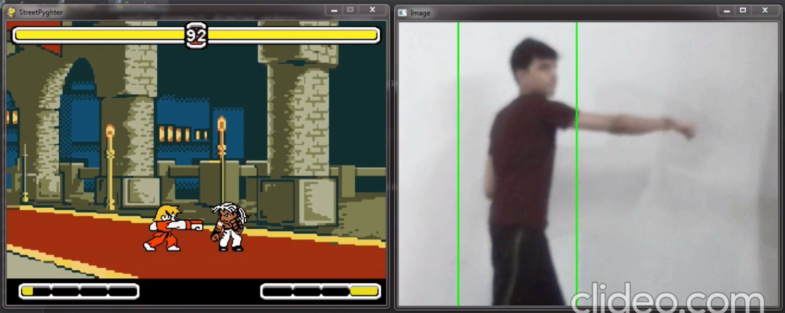
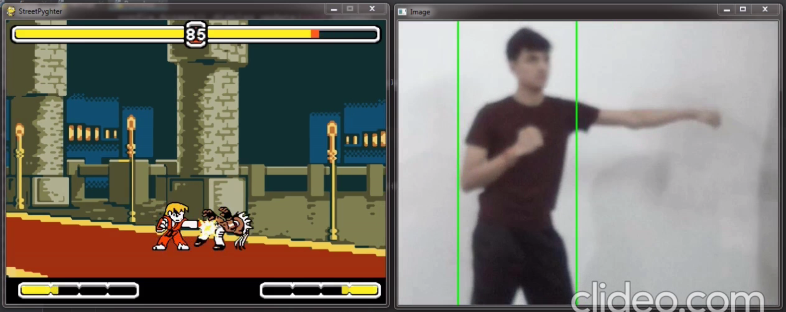
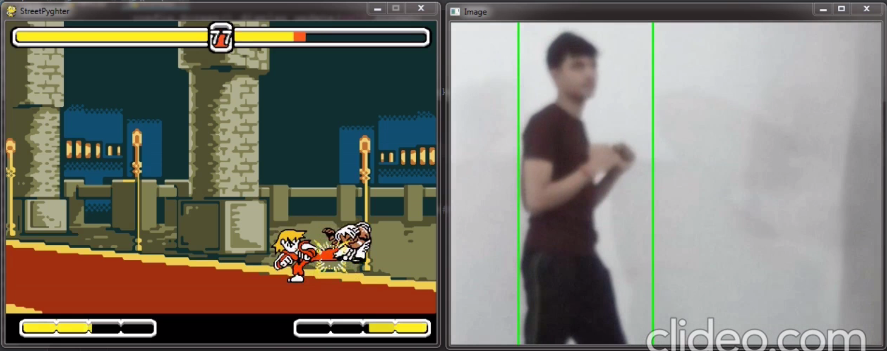

# gesture-controlled-fighting-game
A gesture based fighting game using Python and OpenCV.

The player can perform four actions i.e., punch, kick, move forward, move backward in front of the camera and the corresponding
action will be performed by the player in the game.

This project is developed using Python and its libraries - Pygame, OpenCV.

